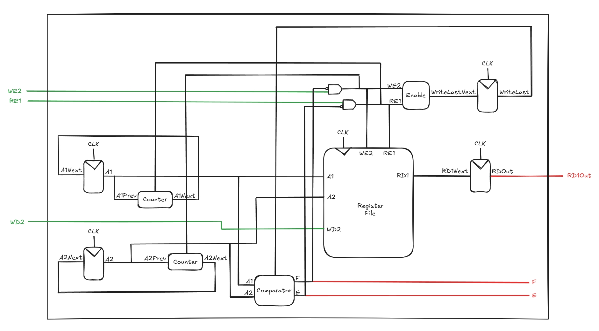

# Synchronous FIFO Buffer

A synchronous FIFO buffer implemented in SystemVerilog with a depth of 64 and a width of 32 bits. Write data is captured one clock cycle after `WR` is asserted and read data becomes valid two clock cycles after `RD` is asserted. The design includes overflow and underflow protection, and correctly handles simultaneous read and write operations.

## Datapath Diagram


## Project Structure
```
sync-fifo/

├── data/         # Numeric inputs

├── images/       # FIFO diagram

├── scripts/      # Python scripts

├── src/          # SystemVerilog source files

├── tb/           # Testbench files
```

## Installation

### 1. Prerequisites
- **Questa** (included with Quartus Prime Lite)

### 2. Clone the Repository
```bash
git clone https://github.com/tebsjejsn/sync-fifo.git
cd sync-fifo
```

## Running the Project

### 1. Program Setup
- Open the repository in Visual Studio Code to browse and edit source files.
- Launch Questa, find the transcript window, and change the working directory to the folder of sync-fifo

### 2. Compilation
> Run the following in the Questa transcript window
```
vlib work
vmap work work
vlog -sv {*}[glob src/*.sv] {*}[glob tb/*.sv]
```

### 3. Load the Testbench
```
vsim -voptargs="+acc" work.tb
```

### 4. Run the Simulation
- Go to the sim window, right-click module named "tb", and select Add > To Wave > All items in region
- Type run -all in the Questa transcript window

## (Optional) Add Unique Operations/Operands

### 1. Insert New Data
- Write new tests in `tb/tb.sv`, or use `generate.py` to produce a random data sequence:
```bash
python3 scripts/generate.py
```

### 2. Repeat Steps
- Follow the previous steps to run the simulation

## License
Distributed under the MIT License. See `LICENSE` for more information.